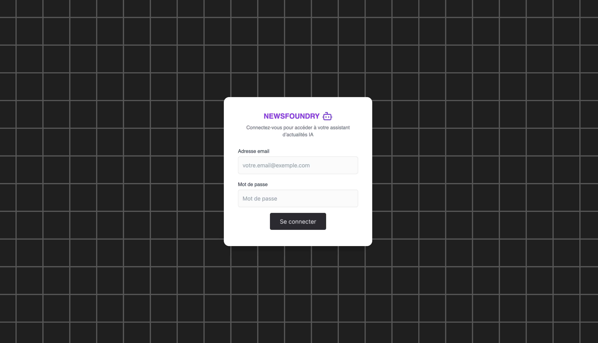
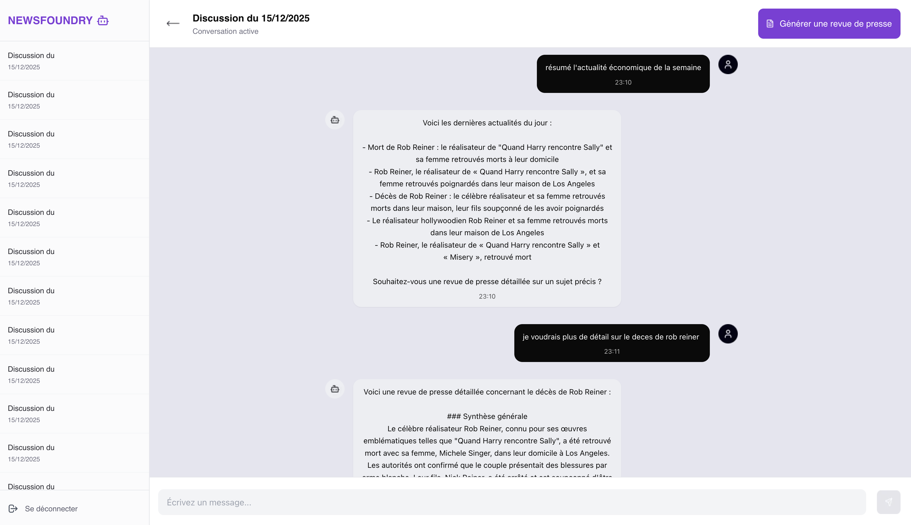
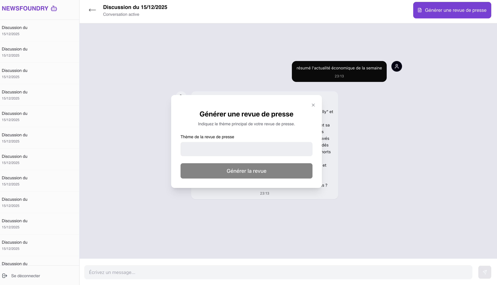
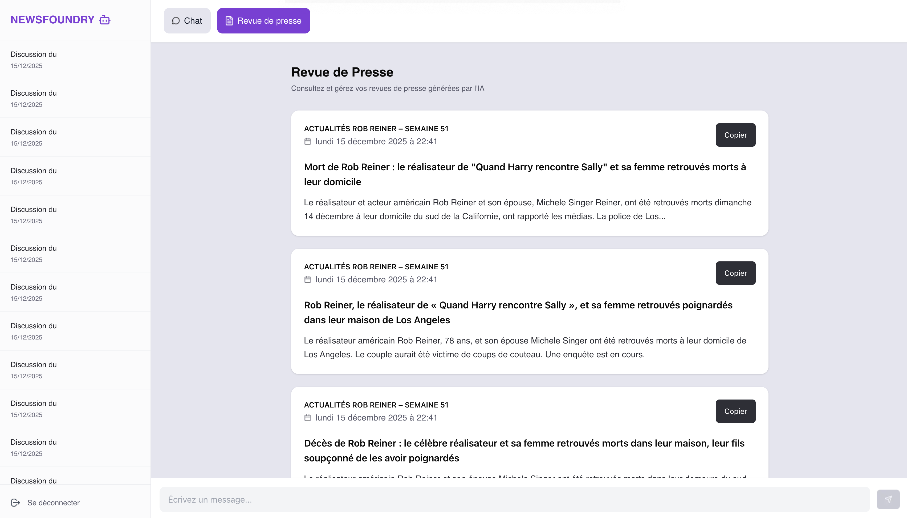

# 🗞️ NewsFoundry — Générateur de revue de presse intelligente

NewsFoundry est une application web permettant de **générer automatiquement des revues de presse** à partir d’un thème donné, en s’appuyant sur un backend alimenté par des sources d’actualités et de l’intelligence artificielle.

Le projet propose une **interface moderne**, fluide et accessible, développée avec **Next.js** et déployée sur **Vercel**.

---

## 🚀 Démo en ligne

👉 **Application déployée sur Vercel**  
🔗 https://p14-news-foundry-frontend.vercel.app

### 🔐 Compte de test

- **Email** : `test@test.com`
- **Mot de passe** : `test`

---

## ✨ Fonctionnalités principales

- 🔑 Authentification utilisateur
- 🗂️ Gestion des discussions (chats)
- 📰 Génération automatique de revues de presse par thème
- 📅 Revue de presse datée et contextualisée (semaine, thème)
- 📋 Copie rapide des articles dans le presse-papiers
- 💬 Continuer la discussion à partir d’une revue générée
- 🧭 Interface claire avec barre latérale
- ♿ Accessibilité

## 🧠 Fonctionnalités avancées & conception IA

### 📅 Problématique des LLMs et données d’actualité

Les **Large Language Models (LLMs)** sont coûteux et longs à entraîner.  
Pour cette raison, les modèles grand public disposent d’une **cutoff date** : toutes les données utilisées pour leur entraînement sont **antérieures à cette date**.

👉 Exemple :  
Le modèle **GPT-5**, sorti en **août 2025**, possède une cutoff date en **octobre 2024**.  
Il ne contient donc **aucune information sur les événements postérieurs** à cette période.

Or, **NewsFoundry** a pour objectif de **répondre à des questions sur l’actualité récente** et de générer des **revues de presse à jour**.

---

## 🌍 Intégration d’actualités en temps réel (World News API)

Pour pallier cette limitation, NewsFoundry **injecte manuellement des données d’actualité récentes dans le contexte du LLM**.

### Principe

1. L’application appelle la **World News API** (`/top-news`)
2. Les articles récents sont récupérés
3. **Seuls les éléments essentiels** sont conservés :
   - le **titre**
   - le **résumé**
4. Ces informations sont intégrées au **prompt système** du LLM

Le contenu complet des articles n’est pas injecté afin de :

- garder un **prompt court**
- réduire les coûts
- éviter la dilution d’information

---

### Résultat attendu

- Lorsqu’un utilisateur pose une question sur l’actualité récente,
- le LLM répond **en se basant sur les données chargées dynamiquement depuis l’API**,
- et non sur ses données d’entraînement obsolètes.

---

## 💾 Persistance du prompt système

Le **prompt système enrichi** (incluant les actualités du jour) est **sauvegardé en base de données**.

### Pourquoi ?

Sans cette sauvegarde :

- le prompt changerait chaque jour
- les discussions en cours deviendraient incohérentes
- la continuité conversationnelle serait rompue

👉 Cette approche garantit :

- une **stabilité des échanges**
- une **traçabilité du contexte**
- une **expérience utilisateur cohérente**

---

## 🤖 Agent conversationnel & outils (Tools)

### Exploration approfondie de l’actualité (option avancée)

L’endpoint `/top-news` retourne un grand nombre d’articles.  
Pour aller plus loin, NewsFoundry implémente une **approche agentique** :

- Le LLM peut **appeler des tools**
- Ces tools déclenchent des **appels API supplémentaires**
- L’agent peut ainsi **explorer plus en profondeur un sujet précis**

---

### 🔧 Tool : recherche d’articles

- Tool connecté à la route `/search-news` de la World News API
- Permet de charger de nouveaux articles à la demande

### Exemple

> _« Donne-moi plus d’informations sur ce sujet »_

➡️ L’agent :

1. appelle le tool `/search-news`
2. récupère de nouveaux articles
3. enrichit sa réponse avec ces nouvelles données

---

### 🧩 Conception des tools

Les formats natifs de l’API sont complexes et peu adaptés aux LLMs.  
Les inputs / outputs des tools sont donc **restructurés** pour être :

- simples
- explicites
- facilement exploitables par l’agent

📚 Références :

- Documentation **PydanticAI — Tools**
- 🔗 https://ai.pydantic.dev/tools/
- Cours **HuggingFace — Agents & outils**

---

## 📰 Génération de revue de presse

### Objectif

Permettre à l’utilisateur de **synthétiser une discussion entière** sous la forme d’une **revue de presse structurée**.

---

### Fonctionnement

- L’utilisateur clique sur **« Générer la revue de presse »**
- Il choisit le **thème principal**
- L’application utilise :
  - **l’historique complet du chat**
  - un **agent IA dédié**, distinct de l’agent conversationnel

👉 Ce choix est volontaire :

> Un **agent spécialisé** est généralement plus performant qu’un agent généraliste.

---

### 📦 Données stockées

Le modèle `Chat` est enrichi pour stocker :

- le **titre** de la revue
- une **synthèse générale**
- une **liste d’articles** avec leur propre résumé

Grâce aux **outputs structurés de PydanticAI**, le format de sortie du LLM correspond exactement aux données persistées en base.

📚 Référence : Documentation **PydanticAI — Outputs**

---

## 🔎 Option avancée : RAG (Retrieval Augmented Generation)

### Objectif

Améliorer la pertinence de la revue de presse en s’appuyant sur **le contenu réel des articles**, et non uniquement sur leur titre et résumé.

---

### Implémentation

- Intégration de **LlamaIndex**
- Indexation des articles chargés durant le chat
- Recherche sémantique pour identifier les articles réellement pertinents

---

### Gestion des articles chargés

- Ajout d’une propriété `loaded_articles` au modèle `Chat`
- Chaque tool-call qui charge un article :
  - sauvegarde son **URL**
- Ces URLs servent de base au système de RAG

---

### Embeddings

- Les modèles d’embedding sont peu coûteux
- Possibilité d’utiliser :
  - un modèle du fournisseur LLM
  - ou un modèle local

---

## 🧩 Résumé

NewsFoundry met en œuvre :

- des **LLMs augmentés par des données temps réel**
- une **architecture agent + tools**
- une **génération de contenu structurée**
- et, en option, une **RAG moderne et efficace**

L’ensemble vise à produire une **revue de presse fiable, contextualisée et exploitable**, malgré les limites inhérentes aux modèles de langage.

---

## 🛠️ Stack technique

### Frontend

- **Next.js (App Router)**
- **React**
- **TypeScript**
- **Tailwind CSS**
- Déploiement : **Vercel**

### Backend (connecté via API)

- API REST (authentification JWT)
- Python
- Génération de contenu
- Gestion des chats et revues de presse
- Déploiement Railway

---

### 🖥️ Aperçu de l’application

#### Connexion utilisateur



#### Interface principale / homepage


#### Interaction et discussion



#### Génération d’une revue de presse



#### Lecture d’une revue de presse



---

## ⚙️ Installation en local

### 1️⃣ Cloner le projet

```bash
git clone https://github.com/hNnicolas/P14_NewsFoundry-Frontend
```

### 2️⃣ Installer les dépendances

```bash
npm install
```

### 3️⃣ Lancer le serveur de développement

```bash
npm run dev
```

### 🔐 Variables d’environnement

Assure-toi d’avoir une variable d’environnement configurée :

```bash
NEXT_PUBLIC_BACKEND_URL=http://localhost:8000
```

(ou l’URL de ton backend déployé)

👤 Auteur
Projet réalisé par Nicolas Huang
Dans le cadre d’un projet de développement web full-stack.
